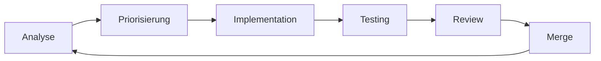

# AuditMySite - Projekt-Analyse & Verbesserungsplan

**Analysedatum:** 2025-01-11  
**Version:** 2.0.0-alpha.2  
**Status:** Alpha

---

## 📊 Projekt-Übersicht

### Metriken
- **127 TypeScript-Dateien** (~40.500 Zeilen Code)
- **17 Testdateien** (Unit, Integration, E2E, Performance)
- **Komplexität:** Hoch - Multi-Layer-Architektur mit paralleler Verarbeitung
- **Dependencies:** 26 production, 22 dev dependencies

### Architektur-Layers
```
bin/audit.js (CLI Entry Point)
    ↓
core/
  ├── accessibility/     → Hauptanalyse-Engine
  ├── browser/          → Browser-Pool-Management
  ├── queue/            → Event-driven Queue-System
  ├── pipeline/         → Analyse-Pipeline
  ├── analyzers/        → Spezialisierte Analyzer
  └── logging/          → Strukturiertes Logging
    ↓
generators/             → Report-Generierung (HTML, JSON, MD)
    ↓
api/                   → REST API Server
sdk/                   → JavaScript SDK
```

---

## 🔍 Identifizierte Problembereiche

### 1. **TypeScript-Typisierung** ⚠️ KRITISCH

**Problem:** Exzessive Verwendung von `any` (>150 Vorkommen)

**Betroffene Dateien:**
- `src/generators/html-generator.ts` (54 Vorkommen)
- `src/adapters/audit-data-adapter.ts` (37 Vorkommen)
- `src/validators/strict-audit-validators.ts` (26 Vorkommen)
- `src/core/performance/web-vitals-collector.ts` (23 Vorkommen)
- `src/cli/commands/audit-command.ts` (15 Vorkommen)

**Auswirkung:**
- Verlust von Type Safety
- Fehlende IntelliSense/Autocomplete
- Runtime-Fehler schwer zu debuggen
- Wartbarkeit eingeschränkt

**Quick Wins:**
```typescript
// ❌ Aktuell
private formatData(data: any): any {
  return data.map((item: any) => item.value);
}

// ✅ Besser
interface DataItem {
  value: string | number;
  timestamp: Date;
}

private formatData(data: DataItem[]): Array<string | number> {
  return data.map(item => item.value);
}
```

---

### 2. **Duplizierte Queue-Systeme** ⚠️ HOCH

**Problem:** Mehrere parallele Queue-Implementierungen

**Gefundene Systeme:**
- `core/queue/queue.ts` (Modern, event-driven)
- `core/pipeline/event-driven-queue.ts`
- `core/pipeline/simple-queue.ts`
- `core/pipeline/priority-queue.ts`

**Auswirkung:**
- Verwirrung für Entwickler
- Inkonsistente API
- Duplicate Code & Logic
- Schwer zu testen

**Empfehlung:**
1. Ein einziges, gut getestetes Queue-System definieren
2. Adapter-Pattern für verschiedene Strategien (Simple, Priority, Parallel)
3. Deprecated-Marker für alte Implementierungen
4. Migrations-Guide erstellen

---

### 3. **Error Handling** ⚠️ MITTEL

**Problem:** Inkonsistentes Error Handling

**Beispiele:**
```typescript
// ❌ Silent catch
try {
  await operation();
} catch {}

// ❌ Generic error
catch (error) {
  console.error('Error:', error);
}

// ✅ Besser
catch (error) {
  logger.error('Operation failed', {
    operation: 'testPage',
    url,
    error: error instanceof Error ? error.message : String(error),
    stack: error instanceof Error ? error.stack : undefined
  });
  throw new OperationError('Failed to test page', { cause: error });
}
```

---

### 4. **Logger-Inkonsistenz** ⚠️ MITTEL

**Problem:** Mix aus `console.log` und strukturiertem Logger

**Gefunden:**
- 9 TODO/FIXME Kommentare in Logger-Dateien
- Mix von `console.log`, `logger.info`, und `this.logger.debug`
- Fehlende Log-Level-Kontrolle in einigen Modulen

**Lösung:**
- Konsequente Verwendung des strukturierten Loggers
- Log-Level-Konfiguration über Environment
- Zentrale Logger-Factory

---

### 5. **Test-Coverage** ⚠️ NIEDRIG-MITTEL

**Status:**
- 17 Testdateien vorhanden
- Keine Coverage-Metriken sofort verfügbar
- Tests für kritische Pfade fehlen

**Priorität:**
1. **Kritisch:** AccessibilityChecker, BrowserPoolManager
2. **Hoch:** Queue-System, Pipeline
3. **Mittel:** Generators, Parsers
4. **Niedrig:** CLI, Utility-Funktionen

---

## 🎯 Verbesserungsplan

### Phase 1: Stabilisierung (Woche 1-2)
**Ziel:** Basis-Stabilität und Type Safety

#### 1.1 TypeScript Strict Mode ✅
```json
// tsconfig.json
{
  "compilerOptions": {
    "strict": true,
    "noImplicitAny": true,           // ← Aktivieren!
    "strictNullChecks": true,        // ← Aktivieren!
    "strictFunctionTypes": true,     // ← Aktivieren!
    "noUncheckedIndexedAccess": true // ← Aktivieren!
  }
}
```

**Vorgehen:**
1. Aktiviere `noImplicitAny` schrittweise pro Modul
2. Start mit `types/` → `core/` → `generators/`
3. Erstelle fehlende Interfaces

#### 1.2 Logging Vereinheitlichen
```typescript
// src/utils/logger-factory.ts
export function createLogger(module: string, options?: LoggerOptions) {
  return new StructuredLogger({
    module,
    level: process.env.LOG_LEVEL || 'info',
    ...options
  });
}
```

#### 1.3 Error Classes
```typescript
// src/errors/index.ts
export class AuditError extends Error {
  constructor(
    message: string,
    public readonly code: string,
    public readonly context?: Record<string, unknown>
  ) {
    super(message);
    this.name = 'AuditError';
  }
}

export class BrowserError extends AuditError {
  constructor(message: string, context?: Record<string, unknown>) {
    super(message, 'BROWSER_ERROR', context);
    this.name = 'BrowserError';
  }
}
```

---

### Phase 2: Refactoring (Woche 3-4)
**Ziel:** Code-Qualität und Wartbarkeit

#### 2.1 Queue-System Konsolidierung
```typescript
// src/core/queue/unified-queue.ts
export class UnifiedQueue<T> {
  constructor(
    private strategy: QueueStrategy<T>,
    private config: QueueConfig
  ) {}
  
  async process(items: T[], processor: QueueProcessor<T>): Promise<QueueResult<T>> {
    return this.strategy.execute(items, processor, this.config);
  }
}

// Strategies
export class SimpleStrategy<T> implements QueueStrategy<T> { }
export class ParallelStrategy<T> implements QueueStrategy<T> { }
export class PriorityStrategy<T> implements QueueStrategy<T> { }
```

#### 2.2 Browser Pool Optimierung
- Connection Pool mit Health Checks
- Graceful Shutdown
- Memory Leak Detection
- Metrics Dashboard

#### 2.3 Pipeline Vereinfachung
- Single Responsibility für Pipeline-Stages
- Klare Schnittstellen zwischen Stages
- Event-basierte Kommunikation

---

### Phase 3: Testing (Woche 5-6)
**Ziel:** 70%+ Coverage für kritische Pfade

#### 3.1 Unit Tests (Priorität 1)
```typescript
// tests/unit/queue/unified-queue.test.ts
describe('UnifiedQueue', () => {
  it('should process items sequentially with SimpleStrategy', async () => {
    const queue = new UnifiedQueue(new SimpleStrategy(), {});
    const items = [1, 2, 3];
    const processor = jest.fn(async (item) => item * 2);
    
    const result = await queue.process(items, processor);
    
    expect(result.completed).toHaveLength(3);
    expect(processor).toHaveBeenCalledTimes(3);
  });
});
```

#### 3.2 Integration Tests
- Browser Pool unter Last
- Pipeline mit echten Websites
- Error Recovery Scenarios

#### 3.3 E2E Tests
- CLI mit verschiedenen Optionen
- API-Endpoints
- Report-Generierung

---

### Phase 4: Performance (Woche 7-8)
**Ziel:** Geschwindigkeit und Ressourcen-Effizienz

#### 4.1 Profiling
```bash
# Memory Profiling
node --inspect --max-old-space-size=4096 bin/audit.js https://example.com/sitemap.xml

# CPU Profiling
clinic doctor -- node bin/audit.js https://example.com/sitemap.xml
```

#### 4.2 Optimierungen
- Lazy Loading für Reports
- Stream-basierte Verarbeitung
- Worker Threads für CPU-intensive Tasks
- Cache für wiederkehrende Analysen

---

### Phase 5: DevEx & Dokumentation (Woche 9-10)
**Ziel:** Developer Experience verbessern

#### 5.1 CLI Verbesserungen
```bash
# Interactive Mode
auditmysite interactive

# Config File Support
auditmysite --config auditmysite.config.js

# Watch Mode
auditmysite watch https://example.com/sitemap.xml
```

#### 5.2 Dokumentation
- API-Dokumentation (TypeDoc)
- Architecture Decision Records (ADRs)
- Contributing Guide
- Code Examples

---

## 📋 Schrittweiser Workflow

### Wöchentlicher Zyklus



### Sprint-Plan

#### Sprint 1: Foundation (Woche 1-2)
- [ ] TypeScript Strict Mode aktivieren
- [ ] Logger vereinheitlichen
- [ ] Error Classes einführen
- [ ] Basic Tests für Core-Module

#### Sprint 2: Refactoring (Woche 3-4)
- [ ] Queue-System konsolidieren
- [ ] Browser Pool optimieren
- [ ] Pipeline vereinfachen
- [ ] Integration Tests

#### Sprint 3: Quality (Woche 5-6)
- [ ] Test Coverage auf 70%
- [ ] Performance Benchmarks
- [ ] Memory Leak Fixes
- [ ] E2E Tests

#### Sprint 4: Polish (Woche 7-8)
- [ ] Performance Optimierungen
- [ ] CLI Improvements
- [ ] Dokumentation
- [ ] Release Preparation

---

## 🔧 Quick Wins (Sofort umsetzbar)

### 1. ESLint + Prettier Setup
```bash
pnpm add -D @typescript-eslint/parser @typescript-eslint/eslint-plugin
pnpm add -D eslint-config-prettier eslint-plugin-prettier
```

```json
// .eslintrc.json
{
  "parser": "@typescript-eslint/parser",
  "extends": [
    "plugin:@typescript-eslint/recommended",
    "prettier"
  ],
  "rules": {
    "@typescript-eslint/no-explicit-any": "error",
    "@typescript-eslint/explicit-function-return-type": "warn"
  }
}
```

### 2. Pre-commit Hooks
```bash
pnpm add -D husky lint-staged
```

```json
// package.json
{
  "lint-staged": {
    "*.ts": [
      "eslint --fix",
      "prettier --write"
    ]
  }
}
```

### 3. CI/CD Pipeline
```yaml
# .github/workflows/ci.yml
name: CI
on: [push, pull_request]
jobs:
  test:
    runs-on: ubuntu-latest
    steps:
      - uses: actions/checkout@v3
      - uses: volta-cli/action@v4
      - run: pnpm install
      - run: pnpm run type-check
      - run: pnpm test
      - run: pnpm run build
```

---

## 📊 Erfolgsmetriken

### Code Quality
- [ ] 0 `any` in Core-Modulen
- [ ] 70%+ Test Coverage
- [ ] 0 ESLint Errors
- [ ] 0 TypeScript Errors (Strict Mode)

### Performance
- [ ] < 30s für 5 Seiten
- [ ] < 5min für 50 Seiten
- [ ] < 500MB Memory Peak
- [ ] < 50% CPU Average

### Stability
- [ ] 0 Memory Leaks
- [ ] < 1% Error Rate
- [ ] 99.9% Browser Pool Uptime
- [ ] Graceful Degradation bei Fehlern

---

## 🎓 Best Practices

### Code Style
```typescript
// ✅ Verwende Guards
function processResult(result: unknown): ProcessedResult {
  if (!isValidResult(result)) {
    throw new ValidationError('Invalid result');
  }
  // result ist jetzt typed
  return transform(result);
}

// ✅ Verwende Enums statt Magic Strings
enum AnalysisType {
  Accessibility = 'accessibility',
  Performance = 'performance',
  SEO = 'seo'
}

// ✅ Verwende Readonly für immutable Data
interface Config {
  readonly maxPages: number;
  readonly timeout: number;
}
```

### Testing
```typescript
// ✅ Test Naming Convention
describe('AccessibilityChecker', () => {
  describe('testPage', () => {
    it('should return passed=true for accessible page', async () => {
      // Arrange
      const checker = new AccessibilityChecker(mockConfig);
      const url = 'https://example.com';
      
      // Act
      const result = await checker.testPage(url);
      
      // Assert
      expect(result.accessibilityResult.passed).toBe(true);
    });
  });
});
```

---

## 🚀 Migration Path

### Für Bestehende Features

1. **Deprecation Warning** (v2.1.0)
```typescript
/**
 * @deprecated Use UnifiedQueue instead. Will be removed in v3.0.0
 */
export class LegacyQueue { }
```

2. **Parallel Support** (v2.2.0)
- Beide APIs funktionieren
- Dokumentation aktualisieren
- Examples für Migration

3. **Removal** (v3.0.0)
- Legacy Code entfernen
- Breaking Change in Changelog

---

## 📚 Ressourcen

### Dokumentation
- [ ] Architecture Overview
- [ ] API Reference
- [ ] Migration Guides
- [ ] Troubleshooting

### Tools
- **Type Coverage:** `type-coverage`
- **Bundle Analysis:** `webpack-bundle-analyzer`
- **Performance:** `clinic.js`
- **Memory:** `memlab`

---

## ✅ Nächste Schritte

1. **Sofort:**
   - pnpm + Volta Setup abschließen
   - ESLint + Prettier konfigurieren
   - Pre-commit Hooks einrichten

2. **Diese Woche:**
   - Test Suite ausführen und Coverage messen
   - Critical Path Tests schreiben
   - TypeScript Strict Mode für types/ aktivieren

3. **Nächste Woche:**
   - Queue-System Audit
   - Browser Pool Health Checks
   - Logger Factory implementieren

---

**Autor:** WARP Agent  
**Review:** Jörn Seidel  
**Next Review:** Nach Sprint 1
